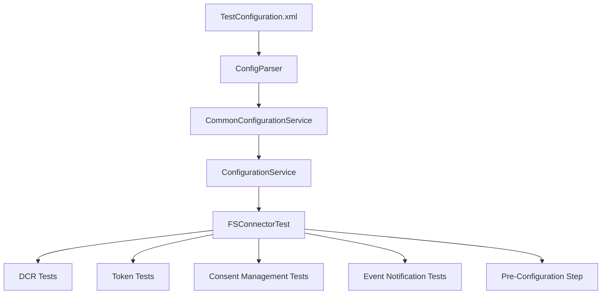

# FS Integration Test Suite – Configuration & Run Guide

---

## Overview

The `fs-integration-test-suite` is a Groovy/TestNG-based integration test suite for the WSO2 Financial Services Accelerator. It validates IS-layer and gateway-layer behaviour including DCR, token flows, consent management, and event notifications.

### Repository Structure

```
fs-integration-test-suite/
├── bfsi-test-framework/          # Base BFSI test framework
├── accelerator-test-framework/   # FS Accelerator test framework & TestConfiguration
│   └── src/main/resources/
│       └── TestConfigurationExample.xml
├── accelerator-tests/
│   ├── is-tests/                 # IS integration tests
│   │   ├── dcr/
│   │   ├── token/
│   │   ├── pre-configuration-step/
│   │   ├── consent-management/
│   │   └── event-notification/
│   └── gateway-tests/            # Gateway integration tests
│       ├── accounts/
│       ├── payments/
│       ├── cof/
│       ├── dcr/
│       ├── token/
│       ├── schema.validation/
│       └── non.regulatory.scenarios/
├── test-artifacts/               # Keystores, SSAs, and other test artifacts
└── pom.xml
```

---

## Prerequisites

Before running the suite you need:

| Requirement | Notes |
|---|---|
| **Java 11** | `maven.compiler.source` and `maven.compiler.target` are set to `11` |
| **Apache Maven** | Used to build and run all modules |
| **WSO2 Identity Server 7.0.0** | Downloaded and set up by `setup.sh` |
| **MySQL** | Required for consent DB |
| **Firefox + GeckoDriver** | Required for browser automation steps |

---

## Step 1 – Automated Environment Setup (CI/CD Path)

The `test-automation/setup.sh` script performs the full environment setup automatically:

1. **Downloads WSO2 IS 7.0.0** and applies WSO2 Updates
2. **Installs Firefox**
3. **Builds the accelerator pack** via Maven from the root `pom.xml`
4. **Unpacks the accelerator zip** (`fs-is`) into the IS home
5. **Installs MySQL** and the MySQL Connector JAR
6. **Generates and exports self-signed certificates**, imports them into the IS keystores (`wso2carbon.jks` / `client-truststore.jks`)
7. **Imports OB Sandbox Root and Issuing CA certificates** into the truststore
8. **Runs `merge.sh` and `configure.sh`** scripts from the accelerator
9. **Applies the event-notification SQL schema** (`mysql.sql`) to `fs_consentdb`
10. **Patches `deployment.toml`** with admin credentials, consent endpoint URL, and extension types.

### Required Environment Variables for `setup.sh`

| Variable | Description |
|---|---|
| `TEST_HOME` | Directory where IS and artifacts are installed |
| `WSO2_USERNAME` | WSO2 account email (for updates) |
| `WSO2_PASSWORD` | WSO2 account password |

---

## Step 2 – Configure `TestConfiguration.xml`

The test framework reads all settings from `TestConfiguration.xml`, which must be placed at:

```
fs-integration-test-suite/accelerator-test-framework/src/main/resources/TestConfiguration.xml
```

Copy the example file and fill in your values:

```bash
cp fs-integration-test-suite/accelerator-test-framework/src/main/resources/TestConfigurationExample.xml \
   fs-integration-test-suite/accelerator-test-framework/src/main/resources/TestConfiguration.xml
```

The `test.sh` script automates filling in this file using `sed` substitutions. Below is the full breakdown of every configurable section.

---

### `<Common>` – General Settings

| XML Element | Description | Example Value |
|---|---|---|
| `<SolutionVersion>` | Accelerator version | `1.0.0` |
| `<IS_Version>` | WSO2 IS version | `7.0.0` |
| `<AccessTokenExpireTime>` | Access token expiry in seconds | `200` |
| `<TenantDomain>` | WSO2 tenant domain | `carbon.super` |
| `<SigningAlgorithm>` | JWT signing algorithm | `PS256` |
| `<TestArtifactLocation>` | Absolute path to the `test-artifacts` directory | `/path/to/fs-integration-test-suite/test-artifacts` |

---

### `<Server>` – Server URLs

| XML Element | Description | Example Value |
|---|---|---|
| `<BaseURL>` | APIM Gateway base URL | `https://<AM_HOST>:8243` |
| `<ISServerUrl>` | WSO2 IS URL | `https://localhost:9446` |
| `<APIMServerUrl>` | WSO2 APIM URL | `https://<AM_HOST>:9443` |

---

### `<Provisioning>` – API Provisioning

| XML Element | Description | Example Value |
|---|---|---|
| `<Enabled>` | Whether to publish/subscribe APIs via tests | `false` |
| `<ProvisionFilePath>` | Absolute path to YAML provisioning file | `/path/to/api-config-provisioning.yaml` |

---

### `<ApplicationConfigList>` – TPP Application Configs

Two applications (TPP1 and TPP2) must be configured. Each `<AppConfig>` block has:

#### Signing Keystore

| XML Element | Description | Example |
|---|---|---|
| `<Location>` | Absolute path to signing `.jks` file | `.../tpp1/signing-keystore/signing.jks` |
| `<Alias>` | Key alias in the keystore | `signing` |
| `<Password>` | Keystore password | `wso2carbon` |
| `<SigningKid>` | Key ID (`kid`) used in JWT headers | `cIYo-5zX4OTWZpHrmmiZDVxACJM` |

#### Transport Keystore (mTLS)

| XML Element | Description | Example |
|---|---|---|
| `<MTLSEnabled>` | Enable mTLS for transport | `true` |
| `<Location>` | Absolute path to transport `.jks` file | `.../tpp1/transport-keystore/transport.jks` |
| `<Password>` | Keystore password | `wso2carbon` |
| `<Alias>` | Transport certificate alias | `transport` |

#### DCR Settings

| XML Element | Description | Example |
|---|---|---|
| `<SSAPath>` | Absolute path to the SSA (Software Statement Assertion) `.txt` file | `.../tpp1/ssa.txt` |
| `<SelfSignedSSAPath>` | Absolute path to self-signed SSA (for negative tests) | `.../tpp1/self_ssa.txt` |
| `<SoftwareId>` | Software ID embedded in the SSA | `oQ4KoaavpOuoE7rvQsZEOV` |
| `<RedirectUri>` | Primary redirect URI | `https://www.google.com/redirects/redirect1` |
| `<AlternateRedirectUri>` | Alternate redirect URI | `https://www.google.com/redirects/redirect2` |
| `<DCRAPIVersion>` | DCR API version | `0.1` |

#### Application Info (pre-registered app)

| XML Element | Description |
|---|---|
| `<ClientID>` | Pre-registered OAuth client ID |
| `<ClientSecret>` | Pre-registered OAuth client secret |
| `<RedirectURL>` | Registered redirect URL |  

---

### `<Transport>` – Truststore

Points to the IS `client-truststore.jks`, which must already contain the server's public certificate.

| XML Element | Example Value |
|---|---|
| `<Location>` | `<IS_HOME>/repository/resources/security/client-truststore.jks` |
| `<Type>` | `jks` |
| `<Password>` | `wso2carbon` |

---

### `<NonRegulatoryApplication>` – Non-Regulatory App

| XML Element | Description |
|---|---|
| `<ClientID>` | Non-regulatory application client ID |
| `<ClientSecret>` | Non-regulatory application client secret |
| `<RedirectURL>` | Redirect URL |

---

### `<PSUList>` – Payment Service Users

List one or more PSU credentials for browser automation consent flows:

```xml
<PSUList>
  <PSUInfo>
    <Credentials>
      <User>testUser@wso2.com</User>
      <Password>testUser@wso2123</Password>
    </Credentials>
  </PSUInfo>
</PSUList>
```

---

### `<TPPInfo>` and `<KeyManagerAdmin>`

---

### `<BrowserAutomation>` – Selenium WebDriver

| XML Element | Description | Example |
|---|---|---|
| `<BrowserPreference>` | `firefox` or `chrome` | `firefox` |
| `<HeadlessEnabled>` | Run browser without UI | `true` |
| `<WebDriverLocation>` | Absolute path to geckodriver or chromedriver | `/path/to/geckodriver` |

The geckodriver can be installed as follows (Linux):

```bash
wget https://github.com/mozilla/geckodriver/releases/download/v0.29.1/geckodriver-v0.29.1-linux64.tar.gz
tar -xvzf geckodriver-v0.29.1-linux64.tar.gz
chmod +x geckodriver
```

---

### `<ConsentApi>` – Audience

| XML Element | Example Value |
|---|---|
| `<AudienceValue>` | `https://localhost:9446/oauth2/token` |

---

### `<ISSetup>` – IS Admin Credentials

This block is appended after `</ConsentApi>`:

```xml
<ISSetup>
    <ISAdminUserName>is_admin@wso2.com</ISAdminUserName>
    <ISAdminPassword>wso2123</ISAdminPassword>
</ISSetup>
```

---

## Step 3 – Build the Test Framework

From within `fs-integration-test-suite/`:

```bash
cd fs-integration-test-suite
mvn clean install -Dmaven.test.skip=true
```

The parent `pom.xml` builds three modules in order:
1. `bfsi-test-framework`
2. `accelerator-test-framework`
3. `accelerator-tests`

---

## Step 4 – Run the IS Test Suite

```bash
cd fs-integration-test-suite/accelerator-tests/is-tests
mvn clean install
```

This runs the following IS test modules:

| Module | What it tests |
|---|---|
| `dcr` | Dynamic Client Registration (create, retrieve, update, delete) |
| `token` | Token endpoint, mTLS enforcement, signature algorithm validation, grant types, token revocation |
| `pre-configuration-step` | Common application creation pre-step |
| `consent-management` | Account, payment, COF consent initiation/retrieval/authorisation/validation/revocation |
| `event-notification` | Event creation, polling, subscription CRUD | 

---

## Step 5 – Run via `test.sh` (Full Automated Run)

The `test-automation/test.sh` script reads a `deployment.properties` file and performs all configuration + test execution end-to-end:

```bash
bash test-automation/test.sh -i <TEST_HOME>
```

It reads server URLs from `test-automation/deployment.properties`:

| Property Key | XML Config Target |
|---|---|
| `BaseUrl` | `<Server><BaseURL>` |
| `ISServerUrl` | `<Server><ISServerUrl>` |
| `APIMServerUrl` | `<Server><APIMServerUrl>` | 

---

## Test Reports

After execution, HTML surefire reports are generated per module:

| Report | Location |
|---|---|
| IS Setup (API Publish) | `is-tests/is-setup/target/surefire-reports/emailable-report.html` |
| DCR | `is-tests/dcr/target/surefire-reports/emailable-report.html` |
| Token | `is-tests/token/target/surefire-reports/emailable-report.html` |
| Consent Management | `is-tests/consent-management/target/surefire-reports/emailable-report.html` |
| Event Notification | `is-tests/event-notification/target/surefire-reports/emailable-report.html` |

---

## Architecture Overview



---

## Notes

- The `TestConfiguration.xml` is loaded at runtime from the classpath. The `ConfigParser` looks for it at the path defined in `ConfigConstants.OB_CONFIG_FILE_LOCATION` if no path is explicitly given; otherwise it uses the file placed in `accelerator-test-framework/src/main/resources/`. 

- The `TestConfigurationExample.xml` must be copied to `TestConfiguration.xml` before running - the automated `test.sh` script does this automatically.

- The `is-setup` module is commented out in the IS test modules' `pom.xml` and is not run by default. It contains Groovy scripts for user creation and API authorization pre-steps.

- The `test-artifacts/DynamicClientRegistration/` directory (containing signing keystores, transport keystores, and SSA files for TPP1 and TPP2) must exist and be populated before running the tests. The `test.sh` script references these paths explicitly.

- The `pre-configuration-step` module (`CommonApplicationCreation`) registers a DCR application and writes the resulting `ClientID` back into `TestConfiguration.xml`, so it must run **before** tests that depend on a pre-registered client ID.

- Browser automation uses Selenium with Firefox (GeckoDriver v0.29.1) and can be run in headless mode by setting `<HeadlessEnabled>true</HeadlessEnabled>`.

